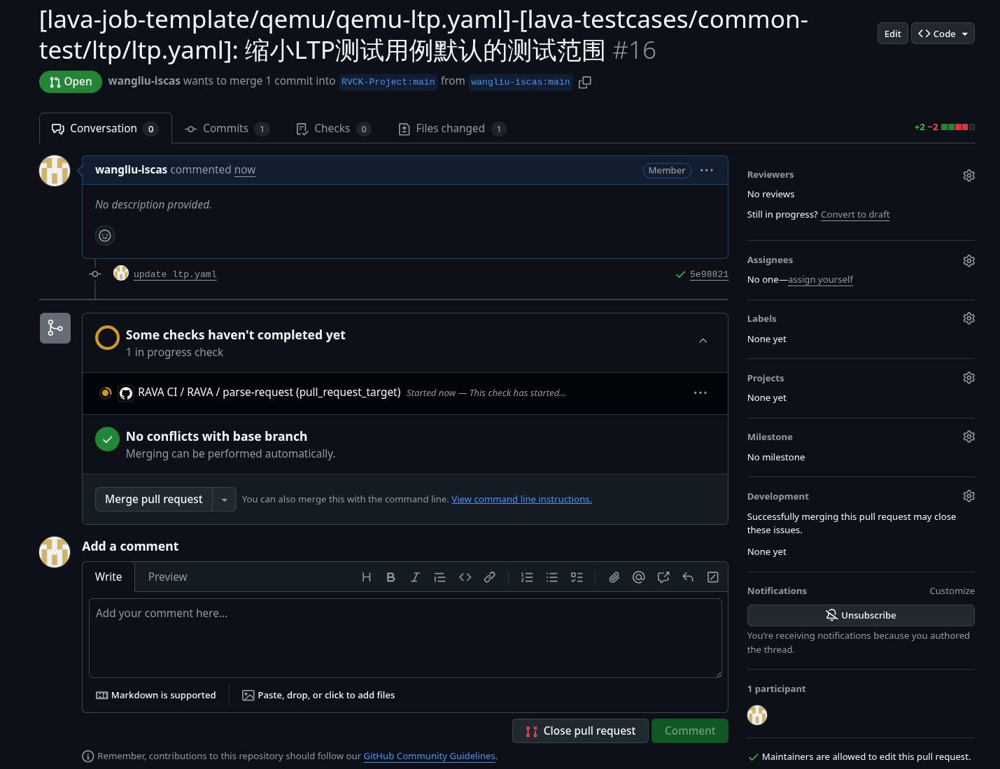
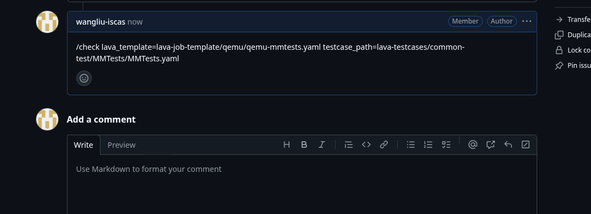
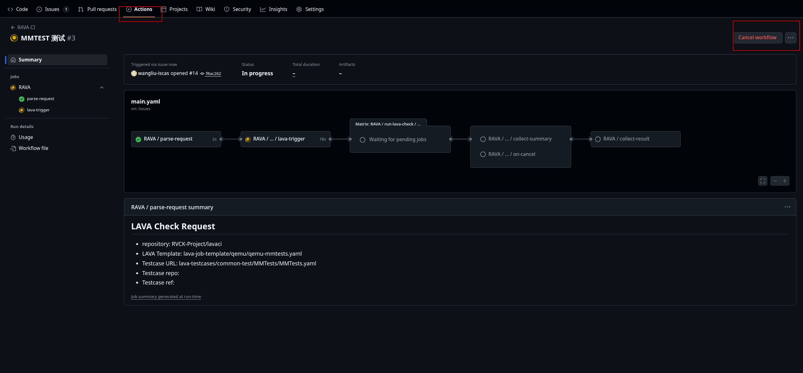

# lavaci


## RAVA CI
### 触发
#### PR
按照指定标题格式提交PR,即可触发CI,标题内容为提交变更所涉及的设备模板或者测试用例文件在仓库里的路径,CI会根据标题去触发相应的lava测试
```
# 示例:
[设备模板路径]-[测试用例路径]: 变更内容

# 使用lavaci仓库中lava-job-template/qemu/qemu-ltp.yaml设备模板和lava-testcases/common-test/ltp/ltp.yaml测试用例进行测试，PR描述： CI test
[lava-job-template/qemu/qemu-ltp.yaml]-[lava-testcases/common-test/ltp/ltp.yaml]: CI test

# 使用lavaci仓库中lava-job-template/qemu/qemu-mmtests.yaml设备模板和lava-testcases/common-test/MMTests/MMTests.yaml测试用例进行测试，PR描述： CI test
[lava-job-template/qemu/qemu-mmtests.yaml]-[lava-testcases/common-test/MMTests/MMTests.yaml]: CI test
```

#### ISSUE
在ISSUE评论里，输入指令以触发CI,CI会根据指令内容运行最新代码的测试
```
# 示例:
/check lava_template=设备模板路径 lava_testcase_url=测试用例路径

# 使用lavaci仓库中lava-job-template/qemu/qemu-ltp.yaml设备模板和lava-testcases/common-test/ltp/ltp.yaml测试用例进行测试
/check lava_template=lava-job-template/qemu/qemu-ltp.yaml lava_testcase_url=lava-testcases/common-test/ltp/ltp.yaml

# 使用lavaci仓库中lava-job-template/qemu/qemu-ltp.yaml设备模板和lava-testcases/common-test/ltp/ltp.yaml测试用例进行测试
/check lava_template=lava-job-template/qemu/qemu-mmtests.yaml lava_testcase_url=lava-testcases/common-test/MMTests/MMTests.yaml
```

### 取消
正在运行的流水线界面当运行到lava-trigger流程以及之后的流程，可点击cancel按钮，即可执行取消流程


### 重试
可以在运行失败或者取消的流水线界面点击Re-run all jobs，即可重新执行
